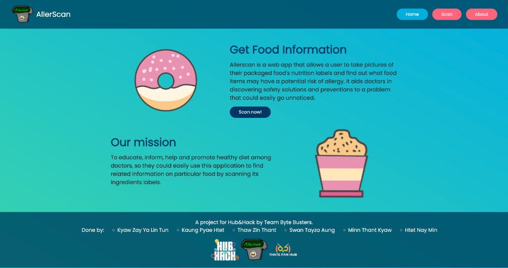
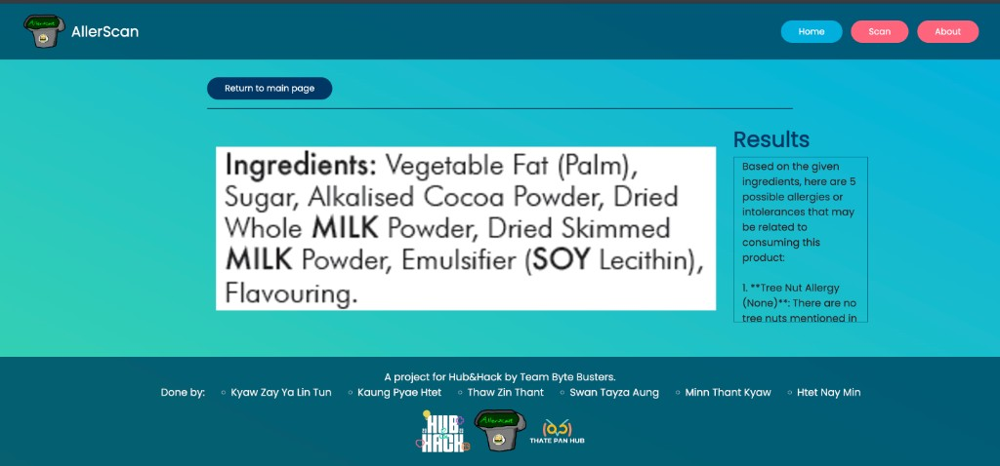
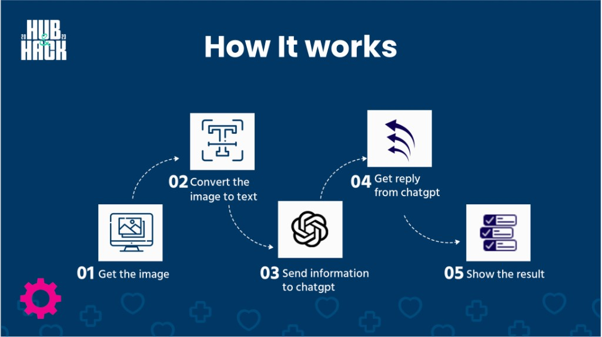

# AllerScan

Food scanner web application that extracts ingredient text from an image and returns possible allergy risks.

## Preview



## Sample Result



## Program Flow



## Tech Stack

- Python 3
- Django 4.1.4
- OpenCV + Tesseract OCR
- Groq API (OpenAI-compatible endpoint)

## Project Structure

- `config/`: Django project config (`settings.py`, `urls.py`, `wsgi.py`, `asgi.py`)
- `aller_scan/`: Main app (views, templates, scanner logic, static files)

## Setup

### 1) Clone and enter the project

```bash
git clone <your-repo-url>
cd allerscan
```

### 2) Create and activate virtual environment

macOS/Linux:

```bash
python3 -m venv .venv
source .venv/bin/activate
```

Windows (PowerShell):

```powershell
python -m venv .venv
.venv\Scripts\Activate.ps1
```

### 3) Install Python dependencies

```bash
pip install -r requirements.txt
```

### 4) Configure environment variables

Copy `.env.example` to `.env` and fill in values:

```bash
cp .env.example .env
```

Required:

- `GROQ_API_KEY`: your Groq API key
- `GROQ_MODEL`: model name (default: `llama-3.1-8b-instant`)

Optional:

- `TESSERACT_CMD`: full path to `tesseract` executable if it is not available in your system PATH
  - Example (Windows): `C:\Program Files\Tesseract-OCR\tesseract.exe`

### 5) Install Tesseract OCR

Tesseract must be installed on your machine:

- macOS (Homebrew): `brew install tesseract`
- Ubuntu/Debian: `sudo apt-get install tesseract-ocr`
- Windows: install from Tesseract installer and set `TESSERACT_CMD` in `.env` if needed

### 6) Run migrations

```bash
python manage.py migrate
```

### 7) Start development server

```bash
python manage.py runserver
```

Open [http://127.0.0.1:8000](http://127.0.0.1:8000)